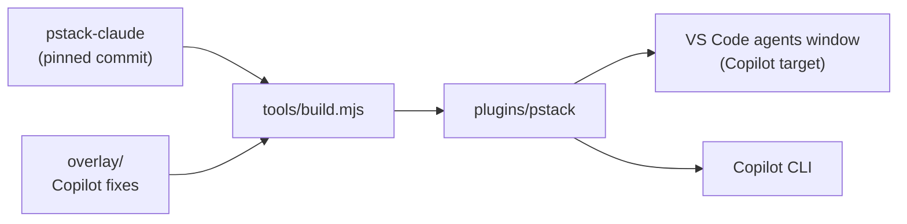

# pstack for GitHub Copilot

[](https://github.com/hackernotfound/pstack-vscode/actions/workflows/check.yml) [](LICENSE) [](https://github.com/hackernotfound/pstack-vscode/releases/tag/v1.0.0)

**Run [pstack](https://github.com/cursor/plugins/tree/main/pstack) in the VS Code agents window with GitHub Copilot.**

pstack is Lauren Tan's ([poteto](https://x.com/poteto)) set of agent workflows. Tell it a goal and it picks the right one: root-cause a bug before fixing it, sketch a design before coding it, race several attempts and keep the best, review a diff with more than one model. Then it proves the result works. This repo makes all 54 of its skills work on Copilot.

[Why](#why-this-exists) · [Install](#install) · [Use it](#use-it) · [T3-style setup](#make-the-agents-window-feel-like-t3) · [What you get](#what-you-get) · [How it works](#how-it-works) · [Security](#security) · [Credits](#credits)

## Why this exists

pstack ships for Cursor, and [pstack-claude](https://github.com/michael-denyer/pstack-claude) ports it to Claude Code. VS Code's new agents window can load Claude Code plugins too, so it looks like pstack-claude should just work there. On the **Copilot** target it doesn't, and nothing tells you:

| What you'd expect | What actually happens on Copilot |
| --- | --- |
| pstack switches on at the start of every session | Copilot ignores the plain text the startup hook prints, so pstack never switches on |
| The skills load as `pstack:poteto-mode`, `pstack:tdd`, ... | Copilot answers "Skill not found" to the `pstack:` prefix |
| Skills call `Agent`, `Skill`, `AskUserQuestion`, `TodoWrite` | Copilot's tools are named `task`, `skill`, `ask_user`, `update_todo` |
| `pstack:poteto-agent` handles delegated work | VS Code rejects every dispatch to it, and its agents window lists each plugin agent twice |

This port fixes all four and leaves pstack's own content untouched. Each fix is checked against the real Copilot runtime, both the Copilot CLI and the copy bundled inside VS Code. The plugin as pstack-claude ships it, unchanged, fails three of those checks.

## Install

### VS Code

1. Open **Preferences: Open User Settings (JSON)** and add:

   ```json
   "chat.plugins.enabled": true,
   "chat.plugins.marketplaces": ["hackernotfound/pstack-vscode"]
   ```

2. In the Extensions view, search `@agentPlugins`, install **pstack**, and accept the trust prompt.
3. Open the agents window and pick **Copilot** in the session target picker.

That's it. Under **Customizations**, pstack now shows up in **Plugins**, its hook in **Hooks**, and `poteto-mode` in **Skills**.

### Copilot CLI

```shell
copilot plugin marketplace add hackernotfound/pstack-vscode
copilot plugin install pstack@pstack-vscode
```

VS Code also lists plugins you install this way.

> **Using the Claude target too?** The Claude target loads your Claude Code plugins from `~/.claude`. Keep pstack-claude for that target, and use this port for **Copilot**.

## Use it

Just work as usual. A change that touches more than one file, a design question, or a bug with an unknown cause switches pstack into `poteto-mode` on its own, and it picks the matching playbook from there.

To start a workflow yourself, ask for it by name:

```text
use poteto-mode to add rate limiting to the API client
run tdd on the date parser bug
architect the new sync engine before writing code
how does auth work in this repo?
```

> **First read in a session.** pstack keeps its playbooks inside the plugin folder, outside your workspace. The first time a session reads one, VS Code asks **Allow reading file outside of workspace?** and shows the plugin path. Choose **Allow in this Session**. Reads of pstack's other files in that session then go through without asking.

<details>
<summary><b>Options</b>: turn off the startup hook, pick models, pin a version</summary>

- **Turn off the startup hook.** Add `session hook: off` to `~/.copilot/pstack-models.md`. pstack then runs only when you ask for it.
- **Pick models.** By default Copilot chooses each subagent's model, because which models you can use depends on your plan. To pin models per role, run `setup-pstack`. It writes `~/.copilot/pstack-models.md` with model names your account accepts, such as `claude-opus-5.5`.
- **Pin a version.** Marketplace installs follow `main`. To stay on one release, clone this repo, check out its tag (for example `v1.0.0`), and in VS Code set `"chat.pluginLocations": { "/absolute/path/to/pstack-vscode/plugins/pstack": true }` instead of the marketplace line.

</details>

## Make the agents window feel like T3

These are VS Code settings, so each person sets them once. Add to your user settings JSON:

```json
"sessions.showChatTabs": "multiple",
"chat.subagents.showCreditUsage": true,
"chat.subagents.allowInvocationsFromSubagents": true,
"chat.agentSessions.showExternal": "none",
"chat.agent.sandbox.enabled": "on"
```

This gives chats tabs, shows what each subagent cost, lets subagents start their own subagents, hides sessions from other tools, and runs the agent's commands in a sandbox.

To watch subagents while they run:

1. **Turn on the Subagents pill.** VS Code hides it by default. Once a chat has started a subagent, right-click the row of pills above the chat input, or click **Configure Session Status Pills**, and tick **Subagents**.
2. **Keep it short.** Right-click the **Subagents** pill and choose **Show In Progress**. Finished subagents then drop off the list.
3. **Open one.** Click a subagent in the pill to open it as a tab, or click its card in the chat to open it in a pane beside the main chat. Each card you click adds another pane.

## What you get

| Skill | What it does |
| --- | --- |
| `poteto-mode` | The entry point. Picks a playbook for your task and holds the work to pstack's principles. |
| `tdd` | Reproduces a bug with a failing test, then fixes it. |
| `architect` | Sketches types and module shape before any code. |
| `arena` | Races several attempts at a task, then keeps and combines the best parts. |
| `interrogate` | Reviews a diff with an adversarial panel of reviewers. |
| `how` / `why` | Explains how code works, or why it was built that way. |
| `unslop` / `deslop` | Cuts filler from prose and from code. |
| `principle-*` | 23 short engineering principles the workflows cite as they work. |

Every skill is in [`plugins/pstack/skills/`](plugins/pstack/skills/).

## How it works



`tools/build.mjs` copies pstack-claude at the commit pinned in [`upstream.json`](upstream.json), adds the Copilot fixes from [`overlay/`](overlay/), and writes the plugin to `plugins/pstack/`. The fixes are:

- **A startup hook that Copilot reads.** It prints the poteto-mode instructions as JSON with an `additionalContext` field, the only hook output Copilot injects.
- **A Copilot tool map.** [`copilot-tools.md`](overlay/skills/poteto-mode/references/copilot-tools.md) translates every Claude tool and model name the skills use. `poteto-mode` points Copilot at it.
- **Bare skill names** in the startup instructions, such as `poteto-mode` rather than `pstack:poteto-mode`.
- **No plugin agents.** Copilot dispatches its built-in `general-purpose` agent and has it load `poteto-mode` first, which is all `pstack:poteto-agent` does. Shipping no agents also keeps VS Code's agent picker free of duplicates.
- **A Copilot-only manifest.** VS Code treats any plugin with a `.claude-plugin/` folder as a Claude plugin, so the port ships only a Copilot `plugin.json`.

Tested on VS Code 1.140.0 and its bundled Copilot runtime, and on Copilot CLI 1.0.91. Updating to a newer pstack, the generated files, and the live tests are covered in [docs/maintaining.md](docs/maintaining.md).

## Security

- **No server, no telemetry.** Whatever the skills ask your agent to read goes only to your model provider.
- **One thing runs by itself.** That's the startup hook. It prints a fixed file from the plugin and reads nothing from your workspace.
- **Scripts run only when your agent runs them.** The helper scripts in `skills/poteto-mode/scripts/` use your `git` and `gh` login. Keep tool approvals on, and leave `chat.tools.autoApprove` off in VS Code.
- **Everything is pinned.** The upstream source is a full commit SHA, the script dependencies install from a lockfile with integrity hashes, and CI actions are pinned to commit SHAs. CI fails if anything floats.

Found a vulnerability? See [SECURITY.md](SECURITY.md).

## Credits

- **[pstack](https://github.com/cursor/plugins/tree/main/pstack)** by Lauren Tan ([poteto](https://x.com/poteto)). The workflows, skills, and principles are hers.
- **[pstack-claude](https://github.com/michael-denyer/pstack-claude)** by Michael Denyer. The Claude Code port this one is built from.
- **cursor-team-kit** skills by Cursor.

MIT licensed. Upstream license and notice files are in [`licenses/`](licenses/), and [NOTICE.md](NOTICE.md) lists what this port adds.
